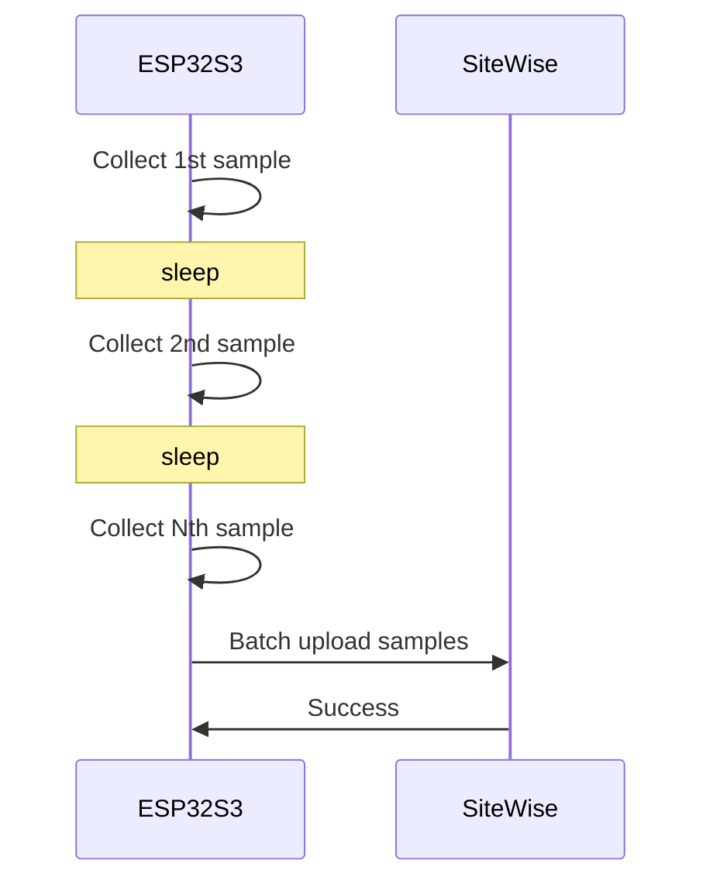
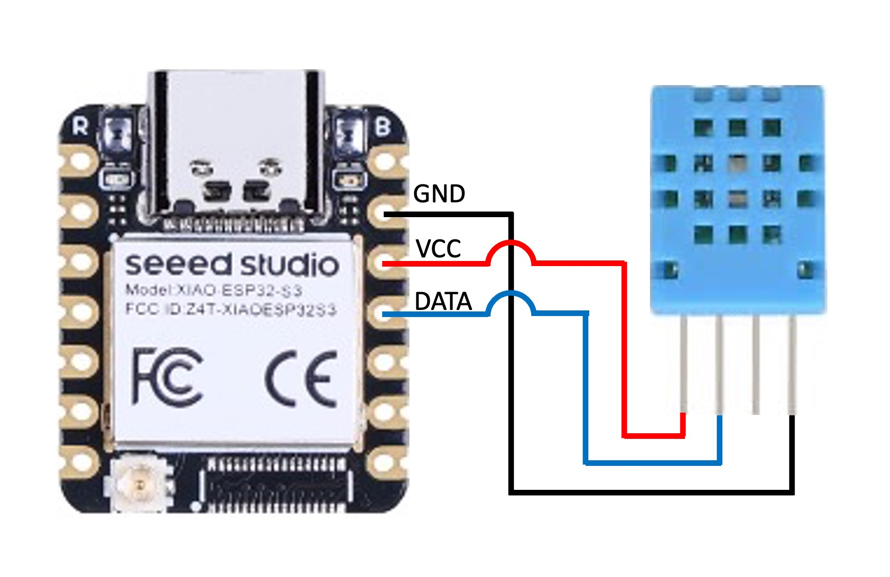
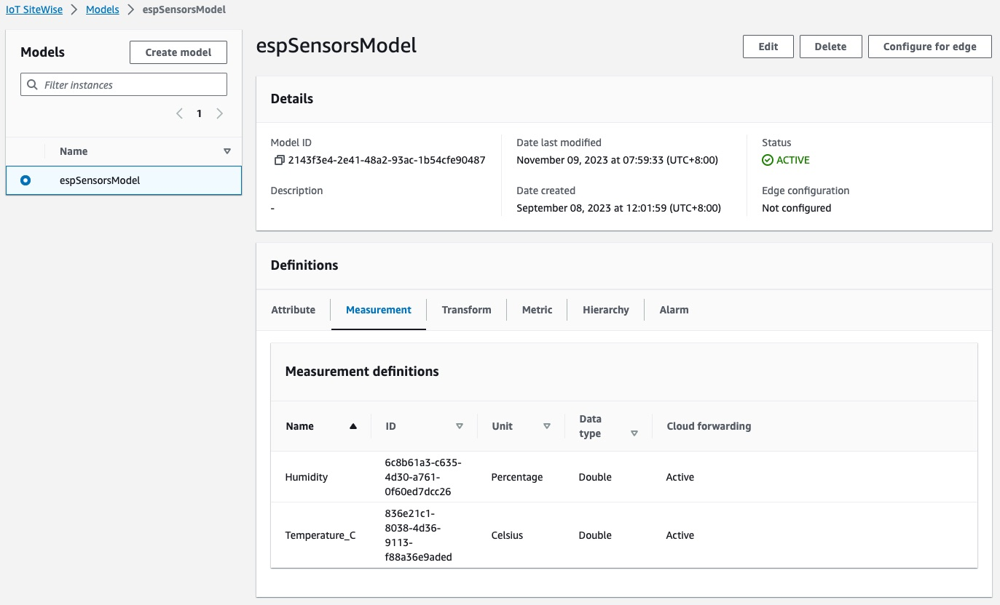
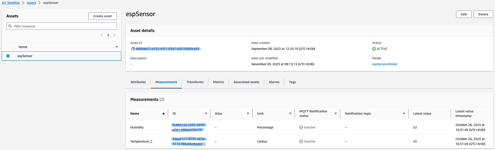
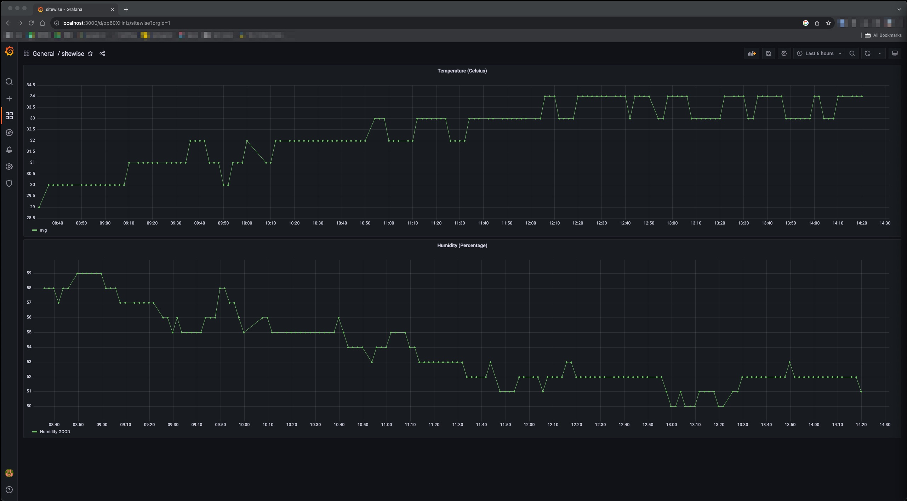

# SiteWise Uploader

This project demonstrates a straightforward approach to uploading temperature and humidity data from a SeedStudio Xiao ESP32S3 to AWS IoT SiteWise.
Unlike traditional methods that rely on AWS IoT Device Shadow for data storage and require redirection to AWS IoT SiteWise for historical data analysis, this approach offers several advantages:

* Efficient Data Upload: Using AWS IoT SiteWise, we can batch-upload multiple data points, allowing the device to enter a sleep state after each data reading. This strategy minimizes network data usage and power consumption, making it ideal for resource-efficient operation.

* Precise Timestamps: When data is uploaded to AWS IoT SiteWise, an accurate timestamp can accompany each data point. In contrast, AWS IoT Device Shadow timestamps data based on the upload time to AWS IoT Core, introducing potential time gaps ranging from milliseconds to seconds.

In this proof-of-concept (POC), I use the SeedStudio Xiao ESP32S3 to read temperature and humidity data from DHT11 sensors. The collected data is then uploaded to AWS IoT SiteWise, allowing us to access and monitor the historical dataset using Grafana conveniently. The follow diagram shows the idea.



By implementing this approach, we streamline the process of data acquisition and analysis, offering improved resource efficiency and more accurate historical data records for better decision-making and monitoring purposes.

# Getting Started

## HW Setup

Below is the hardware I'm using.

* [Seeed Studio Xiao ESP32S3](https://wiki.seeedstudio.com/xiao_esp32s3_getting_started/)
* DHT11

I chose the Xiao ESP32S3 mainly because of its compact size, which doesn't take up much desktop space. If you want to use a different ESP32 board, there shouldn't be any significant issues.

The DHT11 is a common temperature and humidity sensor. It is affordable, easy to obtain, and there is a wealth of information available online about it.

The wiring is as follows.



## Configure AWS IoT SiteWise

First, we need to create a SiteWise model. This model includes two measurements: temperature and humidity, as shown in the image below.



Next, based on the model we just created, we establish an asset. Make sure to note down the Model ID, Temperature ID, and Humidity ID as we will use these when uploading data later.



## Build and Run

Before downloading the demo code, this project is built on top of ESP-IDF v5.1. So please make sure the environment is set up.

Download the demo code with the following command.

```
git clone https://github.com/williamlai/sitewise-uploader.git
cd sitewise-uploader
```

Use the following command to configure this project.

```
idf.py menuconfig
```

Then configure these items:

* **Example Configuration**
  * **Amazon service access key ID**
  * **Amazon service access secret**
  * **Amazon service region**
  * **GPIO output pin 0**: The data pin that we connect it to DHT11/DHT22
  * **DHT TYPE**: 11 for DHT11, 22 for DHT22
  * **The measurement interval in seconds**: In the initial testing phase, it is recommended to use a 2-second interval. You can extend the monitoring interval once you have confirmed that it is working successfully.
  * **SiteWise asset ID**: The SiteWise asset ID we noted in the previous section.
  * **SiteWise property ID for temperature**: The temperature ID.
  * **SiteWise property ID for humidity**: The humidity ID
* **Example Connection Configuration**: The WiFi connection information of network access.

Save the configuration, then build it.

```
idf.py build
```

Flash the image and monitor how it runs.

```
idf.py flash monitor
```

It will collect 10 data samples before uploading to SiteWise. You will see logs similar to the following:

```
I (9543) sitewise_uploader: Collect 1th sample: T:27 H:40
I (11563) sitewise_uploader: Collect 2th sample: T:27 H:40
I (13583) sitewise_uploader: Collect 3th sample: T:27 H:40
I (15603) sitewise_uploader: Collect 4th sample: T:27 H:40
I (17623) sitewise_uploader: Collect 5th sample: T:27 H:40
I (19643) sitewise_uploader: Collect 6th sample: T:27 H:40
I (21663) sitewise_uploader: Collect 7th sample: T:27 H:40
I (23683) sitewise_uploader: Collect 8th sample: T:27 H:40
I (25703) sitewise_uploader: Collect 9th sample: T:27 H:40
I (27723) sitewise_uploader: Collect 10th sample: T:27 H:40
I (27723) sitewise_uploader: Enqueued DHT11 data samples
I (27723) sitewise_uploader: Dequeued DHT11 data samples, and sending them to sitewise
I (32423) sitewise_uploader: HTTP POST Status = 200, content_length = 19
{"errorEntries":[]}
```

You can also check the AWS SiteWise console and see if the temperature and humidity properties have been updated.

## View historical data on Grafana

Grafana is a common dashboard tool used for data visualization and management. Next, we will view our data in Grafana. The simplest way to make Grafana use your local AWS configuration to access data is through Docker. Below are the steps to create a dashboard using Docker.

Create a folder to hold Grafana plugins data. Here my folder name is `local_grafana_data/plugins`.

```
mkdir -p local_grafana_data/plugins
```

Run the following command to launch a docker container.

```
docker run -d -p 3000:3000 \
    --name=sitewise-grafana \
    -v ~/.aws:/usr/share/grafana/.aws \
    -v local_grafana_data:/var/lib/grafana \
    -e "GF_INSTALL_PLUGINS=grafana-iot-twinmaker-app" \
    grafana/grafana:8.4.0
```

Here are the meanings of each parameter.

* `-d`: Detach mode.
* `-p 3000:3000`: Map the local port 3000 to docker port 3000.
* `--name=sitewise-grafana`: The container's name is `sitewise-grafana`.
* `-v ~/.aws:/usr/share/grafana/.aws`: Map the local folder `~/.aws` to container's folder `/usr/share/grafana/.aws`. This allows Grafana to use AWS credentials.
* `-v local_grafana_data:/var/lib/grafana`: Map the local folder `local_grafana_data` to container's folder `/var/lib/grafana`. This allows us to save the plugin's data for the next time.
* `grafana/grafana:8.4.0`: The image name

Open the browser for the link [http://localhost:3000](http://localhost:3000). You need to login for the first time. The default username and password is admin/admin. You'll be asked to change the password the first time you log in. Or you can skip it for the next time.

In the left menu, choose "Create" -> "Dashboard." Then, within the panel, select "Add a new panel." In the bottom left corner, in the "Data source" field, choose "AWS IoT SiteWise." For "Query type," select "Get property value history." Choose the desired asset for "Asset" and select "Temperature_C" for "Property." Finally, click "Apply" in the upper right corner.

Next, select "Add panel" in the upper right corner and repeat the process. This time, choose "Humidity" for the "Property." Once completed, your dashboard should look like the diagram below.



# Summary

In this demo project, I collect several data samples on the ESP32S3 and upload them to AWS IoT SiteWise. During data collection, the device can be in a sleep state to save energy and reduce the frequency of data uploads, thus minimizing network data usage. This approach differs from the use of AWS IoT Core, each with its own advantages and disadvantages.

This source code still has many areas for improvement, but it's relatively concise, making it suitable for demonstration purposes. If you intend to use it for long-term execution, it's crucial to add security checks and proper error handling to ensure robustness.
